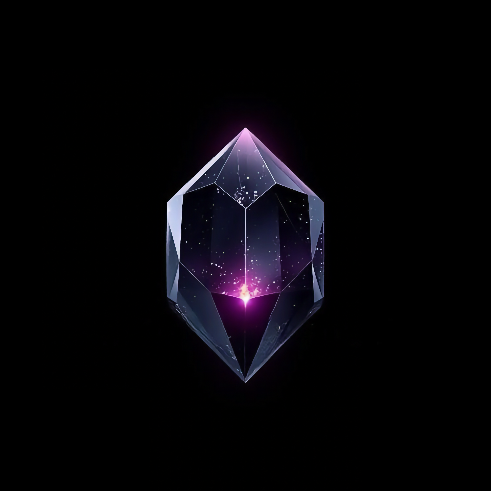

  

<h1 align="center">Anthracite</h1>

A Claude-native AI assistant for <a href="https://obsidian.md">Obsidian</a> — chat, think, and edit your vault with Claude.

## Features

- **Chat with Claude** in a sidebar panel with full Markdown rendering
- **Extended Thinking** — watch Claude reason through complex questions with a collapsible thinking inspector
- **Agent Mode** — Claude can read, search, create, and edit notes in your vault (with approval)
- **Smart Context** — automatically includes relevant notes via backlinks, tags, and folder siblings
- **Vision** — drag and drop images for Claude to analyze alongside your notes
- **Custom System Prompts** — point to any vault note to customize Claude's personality
- **Chat History** — conversations saved as Markdown files in your vault
- **Multiple Models** — choose between Claude Sonnet 4, Haiku 4, or Opus 4

## Security

- API key stored in Obsidian's SecretStorage (OS keychain)
- Write operations require explicit user approval via confirmation modal
- Backup reminder before first vault modification
- Protected paths prevent changes to `.obsidian/` and plugin folders
- No file deletion capability by design

## Setup

1. Install the plugin
2. Go to **Settings > Anthracite** and link your [Anthropic API key](https://console.anthropic.com/settings/keys) via Obsidian Secrets
3. Click the chat icon in the ribbon to start

## About the Name

**Anthr**acite — a nod to [Anthropic](https://anthropic.com), the makers of Claude. Like obsidian, anthracite is a metamorphic mineral: raw material transformed under pressure into something refined and useful. A fitting name for an AI that helps transform your notes.

## Credits

Designed by [Geoff Love](https://github.com/Zenithbach). Architecture, code, and documentation by [Claude](https://claude.ai) (Anthropic). Built as a human-AI collaboration using [Claude Code](https://docs.anthropic.com/en/docs/claude-code).

## License

MIT
